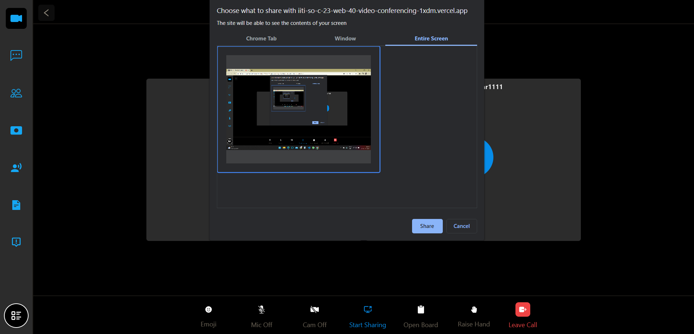

# Video Conferencing Website
Video Conferencing Website project under IITISoC 2023. <a href = "https://iiti-so-c-23-web-40-video-conferencing-1xdm.vercel.app/" target = "blank"> (Deployment Link) ConferoLive </a>


## Team Details
- Pradeep Kumar Rebbavarapu (220001058): <a href = "https://github.com/Pradeep-Kumar-Rebbavarapu/" target = "blank"> GitHub </a>
- Trishant Kumar Talluri (220005054): <a href = "https://github.com/TRISHANT131104/" target = "blank"> GitHub </a>
- P C Uma Mahesh (220001052): <a href = "https://github.com/Hi-TechMissile/" target = "blank"> GitHub </a>
- Mallavarapu Sai Varshith (220001044): [GitHub](https://github.com/SaiVarshithBeginner/)

## Team Mentors
- Abhinav Kumar (210001002)
- Nilay Jayantibhai Ganvit (200001053)

## Problem Statement
The task is to build an online video conferencing web application for real-time messaging, collaboration and video calling. Users can conduct and join meetings via links and share files and presentations including screen share, whiteboard and speech-to-text.

# Running the App locally

> Prerequisites: <a href = "https://nodejs.org/en/" target = "blank"> Node.js </a>, <a href = "https://git-scm.com/" target = "blank"> Git </a> and npm installed.

- Clone this repository using the following command:
    ```git clone https://github.com/kr-2003/IITISoC-23-Web-30-Video_conferencing.git```

## Setting up Backend

  * ```pip install django```
  * ```django-admin startproject server```
  * ```cd server```
  * ```python -m venv venv```
  * ```venv\Scripts\activate```
  * ```pip install -r requirements.txt```
  * ```python manage.py makemigrations```
  * ```python manage.py migrate```
  * ```python manage.py runserver```

## Setting up the Frontend

  * ```pnpm i --force``` or ```npm install --force```
  * ```npm run dev``` or ```pnpm dev```
  * Open ```https://localhost:8000``` or the link that appears in the terminal in any web browser. Local deployment complete.

# Features


  * Sign Up and Authentication - New users can sign up on the platform using the "Join Us" button at the top right of the screen on the navbar, then by clicking the "Register" link at the bottom. The user will receive an OTP to the entered email to verify the sign up. However, sign up with Google is also available. After that, the user will be logged in automatically. Existing users can log in with their password, username and email.
<hr>


  * (AI Speech-to-Text converter) - Our advanced AI-driven Speech-to-Text converter effortlessly transcribes spoken English into written format, facilitating efficient documentation. Additionally, it offers a concise summarization feature to condense the content for enhanced comprehension, enabling users to download the summarized text in a professional manner.
<hr>


  * White Board - It facilitates users to convey concepts through hand-written illustrations during collaborative sessions. The feature to download meeting notes further ensures seamless post-meeting reference, fostering efficient communication and creativity in a professional environment.
<hr>


  * File sharing - Our file sharing feature empowers users to seamlessly share files during meetings, either publicly with all members or privately with individuals. This enhances collaboration, fostering a new level of seamless and efficient teamwork.
<hr>


  * Messaging - The integrated messaging feature facilitates seamless, private, and public communication among users. This broader scope of interaction enhances understanding, fostering a professional environment conducive to improved teamwork and productivity. It also has a facility to reply back to a message.
<hr>


  * Recording and screen sharing - User can record a meet personally and download it on their computer, in case they want to have a preview of the meet. Additionally, any participant can share their screen using the option available at the bottom of the room to present their content to everyone in the meet.
<hr>


  * Emoji - Our platform offers an expressive emoji feature, allowing users to convey emotions effectively, fostering a vibrant and engaging communication experience.
<hr>
